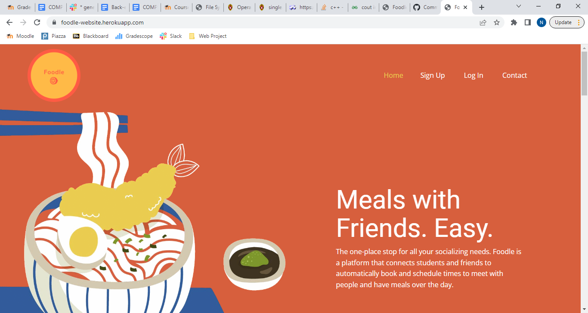
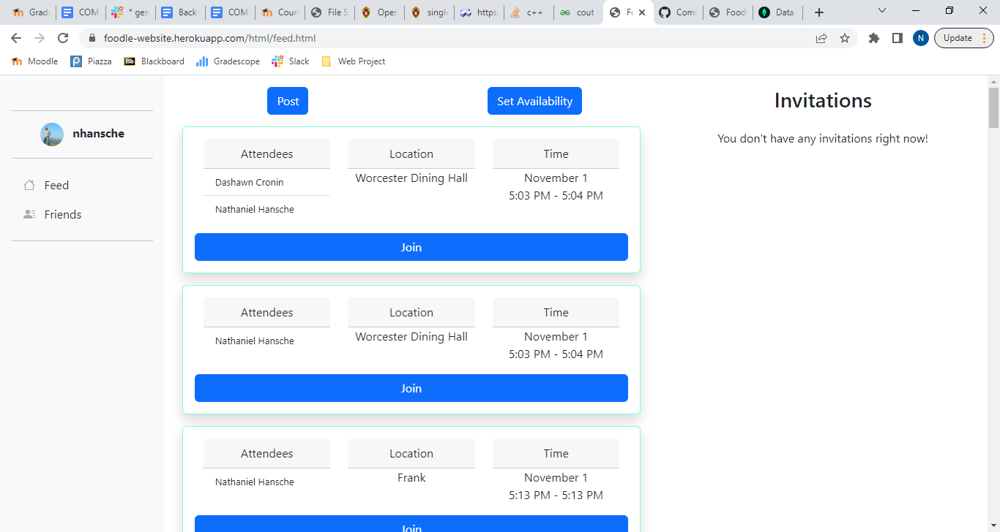
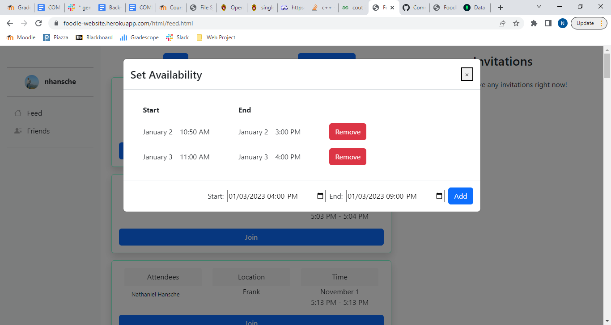
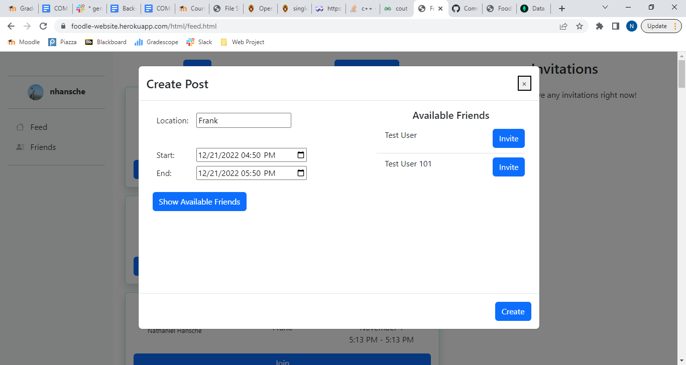
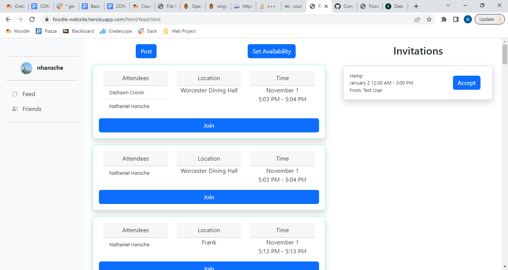
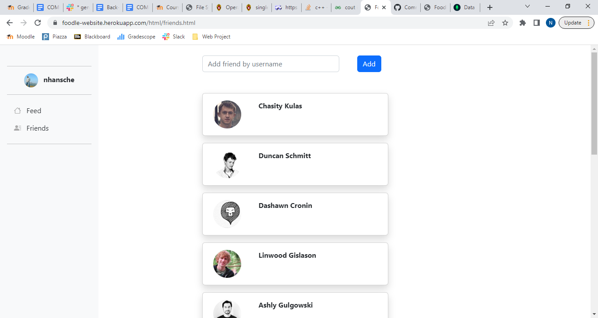
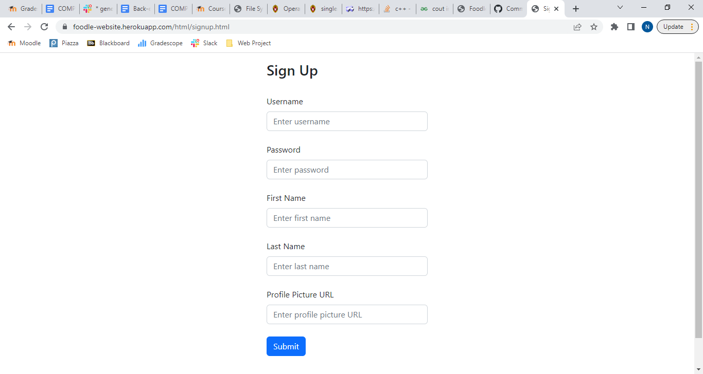
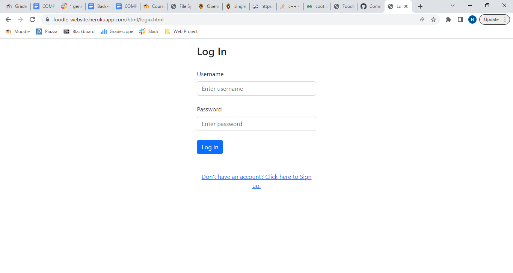

# Omega
## Foodle
### Fall 2022

URL: https://foodle-website.herokuapp.com/

## Overview

Each day I try to have my meals with different groups of people so that I can keep up with all of my friends. However, coordinating meals with different groups each day is often a hassle. I either have to message multiple people separately or make a new group chat to make sure that everybody is free at the same time, and then invite other friends if anyone isn't available. Doing this for multiple meals each day takes time and effort. To solve this issue, Foodle makes it fast and simple to schedule meals with friends. 

Foodle achieves this goal by matching users with their friends who are available at the same time as them. When users want to schedule a meal with friends, they create a post, choosing the time and location they wish to plan their meal for. Upon choosing the meal time, the user is shown a list of their friends who are available during that time, with the ability to invite them with a single click. Additionally, users are shown a feed of their friends' posts, each of which displays the location, time, and list of users attending the meal with the ability to click one button to join in on the fun.

## Team Members

* Nathaniel Hansche (anti4m)
* Adrian Chase (adriancchase)
* Jawad Alam (malam1210)

## User Interface

### Landing Page

The landing page has "Sign up" and "Log In" links in the navigation bar at the top. 

* Click on "Sign Up" to create an account, allowing you to input your account information and then sending you to the login page. 

* To log in to an existing account, click on "Log In". After inputting your username and password, you will be sent to the feed page.

### Feed Page

#### Post Feed

The post feed displays a list of posts made by a user's friends. Each post corresponds to a planned meal, and contains the location, start and end times, and list of users attending the meal. The user may click the "Join" button on any post to be added to the list of attendees.

#### Set Availability Menu

Clicking the "Set Availability" button on the feed page displays a menu with a list of the user's current availability time windows (start and end times), allowing the user to create and delete these time windows as needed.

#### Create Post Menu

Clicking the "Post" button on the feed page displays a menu for creating a new post. To plan a meal, the user can input the location and start and end times. Upon choosing a time, the user can click the "Show Available Friends" button on this menu to show a list of their friends who are available at the specified time. Each friend has an "Invite" button next to their name, which allows the post author to invite that friend to their meal, with the invitation appearing in the friend's invitation list on the right side of the feed page.

#### Invitation List

The invitation list on the right side of the feed page displays invitations to friends' meals, with each invitation containing the name of the user who sent the invitation along with the meal location and start and end times. Clicking the "Accept" button on an invitation will add the user to the list of attendees for the corresponding meal post.

### Friends Page

The friends page can be accessed through the "Friends" button on the sidebar. It displays a list of the user's friends, along with their profile pictures. The user may add a new friend by their username by typing it into the text box and clicking "Add". Adding a person as a friend allows you to see their posts, but they must also add you as a friend in order to see your posts.

### Sign Up Page

The sign up page is accessible through the "Sign Up" button on the home page. It allows a new user to set their username, password, first name, last name, and the URL to their desired profile picture. Clicking the "Submit" button will create their account and send them to the login page.

### Login Page

The log in page is accessible through the "Log In" button on the home page. It allows an existing user to input their username and password. Clicking the "Log In" button will send the user to the feed page, displaying the relevant posts for their account.

## API Specification and URL Routes

See the Database section for definitions of the data types being referenced below.

### Post Endpoint

    POST /post/new

Creates a new post.

Request Body: Post object without the '_id' or 'timestamp' fields.

    GET /post/{id}

Returns the Post object with the ID given in the URL.

Request Body: None

    PUT post/{id}/join

Adds the username given in the request body to the list of attendees for the Post object with the ID given in the URL.

Request Body: { userName: string }

    PUT /post/{id}/invite

Sends an invitation to each user specified in the request body for the post corresponding to the ID in the URL.

Request Body: {
    /* Username of the user who sent the invitation. */
    from: string;
    /* Array of usernames for the users to invite to the post.*/
    friendsToInvite: string[];
    /* Location of meal in the post. */
    location: string;
    /* Meal start and end times in the post. */
    timeInterval: TimeInterval;
}

### User Endpoint

    GET /user

Returns all users.

Request Body: None

    GET /user/{userName}

Returns the User object with the username given in the URL.

Request Body: None

    GET /user/{userName}/availability

Returns the array in the 'availability' field of the User object with the username given in the URL.

Request Body: None

    PUT /user/{userName}/availability

Adds a TimeInterval object to the 'availability' field of the User object with the username given in the URL.

Request Body: TimeInterval

    DELETE /user/{userName}/availability?start={startDateString}&end={endDateString}

Deletes a TimeInterval object from the 'availability' field of the User obejct with the username given in the URL. The start and end dates in the TimeInterval are given in the URL query parameters as date strings.

Request Body: None

    GET /user/{userName}/friends

Returns an array of FriendView objects for all friends of the user with the username given in the URL.

Request Body: None

    PUT /user/{userName}/friends

Adds the username in the request body to the friends list of the user with the username given in the URL.

Request Body: { 
    /* Name of friend to be added. */
    friendUserName: string 
}

    GET /user/{userName}/feed

Returns an array of PostView objects for all posts in the feed of the user with the username given in the URL.

Request Body: None

    PUT /user/{userName}

Updates the user with the username given in the URL with the fields given in the request body.

Request Body: Object containing subset of User object fields

    DELETE /user/{userName}

Deletes the user with the username given in the URL.

Request Body: None

    POST /user/{userName}/session

Authenticates given username and password using stored password salt and hash, returning a { session: { userName: string } } object which is used to authenticate the client.

Request Body: { password: string; }

## Database

The database is MongoDB hosted on the MongoDB Atlas platform. User objects are stored in the 'user' table and Post objects are stored in the 'post' table. There are two other object types, TimeInterval and PostInvitation, that are stored within these objects. The type definitions are as follows.

### Post

    _id: ObjectId
    /** Post creation timestamp. */
    timestamp: Date;
    /** Username of author */
    author: string; 
    /** List of usernames for users attending the meal */      
    attendees: string[];   
    /** Name of restaurant */
    location: string;       
    /** Meal start/end times */
    timeInterval: TimeInterval;  
    /** ID of chat created for attendees -- currently unused */   
    chatId: string;   

### User      

    _id: ObjectId
    /** Unique username */
    userName: string;  
    /** Password encrypted using hash function with salt. */
    passwordHash: string;
    /** Salt used for computing encrypted password. */
    passwordSalt: string;
    /** Real first name */
    firstName: string;
    /** Real last name */
    lastName: string;
    /** Profile picture */
    pictureUrl: string; 
    /** Start/end times where user is available */
    availability: TimeInterval[];   
    /** Posts made by the user */
    posts: string[];    
    /** List of friends' usernames */
    friends: string[]; 
    /** IDs for posts displayed in user's feed */
    feed: string[];    
    /** IDs of posts that the user is signed up to attend */
    attending: string[];
    /** IDs of posts that the user has been invited to, but the user has not accepted */
    invitations: PostInvitation[];  

### PostInvitation

    from: UserView;
    location: string;
    timeInterval: TimeInterval;
    postId: ObjectId;

### TimeInterval

    start: Date;
    end: Date;

## Division of Labor

Note: Besides the landing page, all of the code that is currently functioning on the website was written by Nathaniel.

* Nathaniel
    * Backend - Programmed the entire backend.
        * Set up MongoDB database.
        * Designed and implemented all API endpoints.
        * Created data type specification and TypeScript type definitions.
    * Frontend - Programmed the entire frontend except for the landing page.
        * Feed Page - Includes the post feed itself along with post creation menu, set availability menu, and invitations display.
        * Login/Signup pages - Redid initial HTML/CSS from Jawad to include different fields, changed styling, and connected to backend.
        * Friends Page - Redid initial HTML/CSS from Jawad for the friends display, connected to backend, and implemented search box for adding friends.
        * Sidebar/navigation bar.
    * Deployment
        * Deployed to Heroku.
    * Misc
        * Wrote ideas.md, milestone2.md, milestone3.md, setup.md, final.md. 
        * Created final video.
* Adrian
    * Frontend
        * Landing page.
    * Misc
        * Wireframes.
* Jawad
    * Frontend
        * Initial HTML/CSS for static friends page.
        * Initial HTML/CSS for static Login/Signup pages.
      