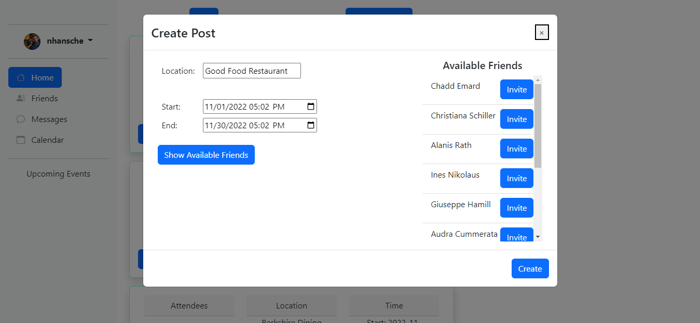
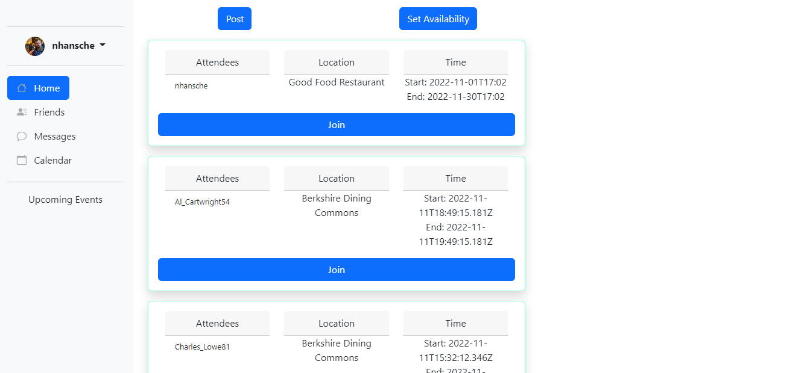
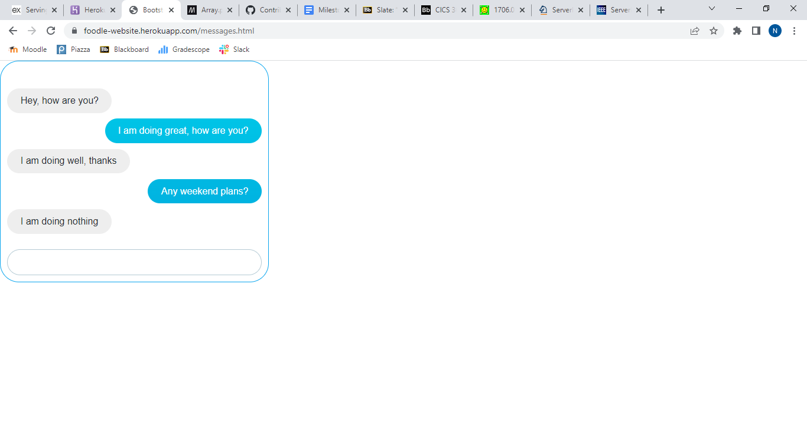
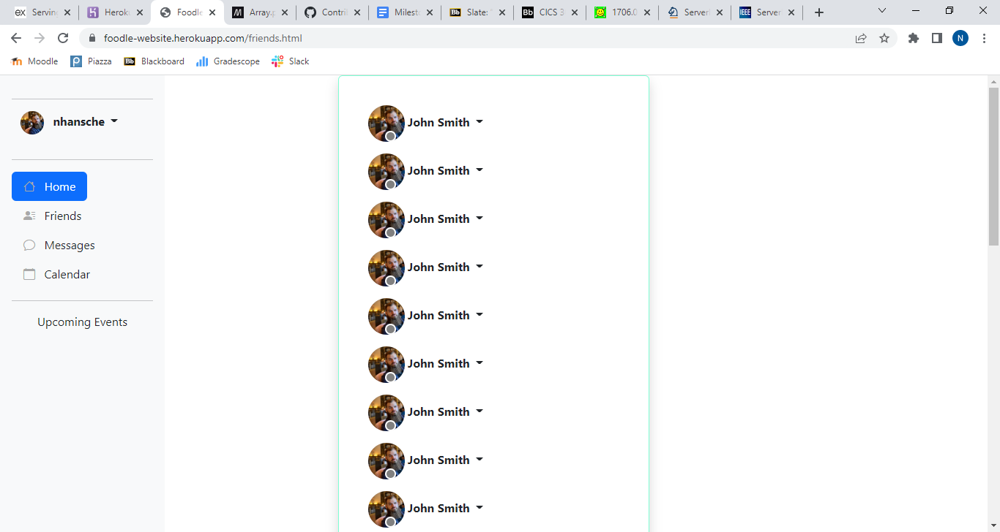
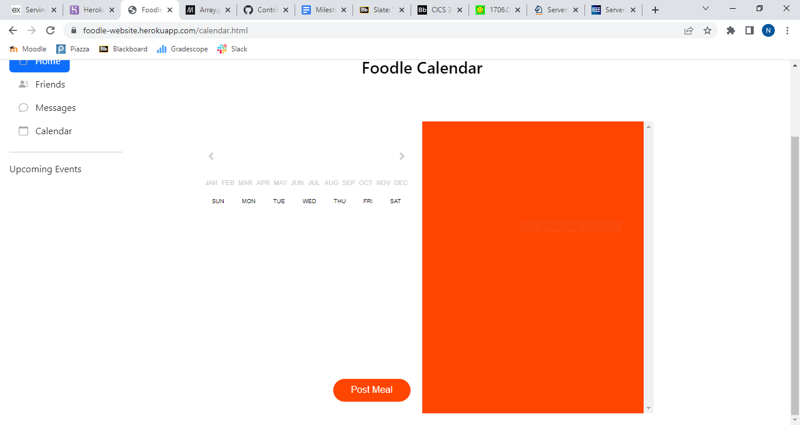

# API Description 

## Data Types

### User

    {
        // Unique username
        userName: string;  
        // Real first name 
        firstName: string;
        // Real last name
        lastName: string;
        // Profile picture
        pictureUrl: string; 
        // Start/end times where user is available
        availability: TimeInterval[];   
        // Posts made by the user
        posts: string[];    
        // List of friends' usernames
        friends: string[]; 
        // IDs for posts displayed in user's feed 
        feed: string[];  
        // IDs of posts that the user is signed up to attend
        attending: string[];
        // IDs of posts that the user has been invited to, but the user has not accepted
        invited: string[];  
    }

### UserView

    {
        userName: string;
        firstName: string;
        lastName: string;
        pictureUrl: string;
        availability: TimeInterval[];
    }

Contains a subset of the fields in User, and is used to display a user's public profile information.

### Post

    {
        // Post ID
        id: string;
        // Username of author
        author: string; 
        // List of usernames for users attending the meal        
        attendees: string[];   
        // Name of restaurant 
        location: string;       
        // Meal start/end times
        timeInterval: TimeInterval;  
        // ID of chat created for attendees   
        chatId: string;     
        // Usernames of users who this post will be made visible to    
        visibleTo: string[];    
    }

### PostView

    {
        author: UserView;
        attendees: UserView[];
        location: string;
        timeInterval: TimeInterval;
    }

The fields used to display a post. Note that, compared to a regular Post object, the username strings are replaced with UserView objects.

### Chat

    {
        id: string;
        messages: Message[];
    }

### Message

    {
        // Username of sender
        sender: string;
        // Message text contents
        text: string;
    }

### TimeInterval

    {
        start: Date;
        end: Date;
    }

## API Endpoints

### User

    POST user/new

Creates a new user. Request body must conform to the User object schema.

    GET user/{username}

Returns the User object with the given username.

    PUT user/{username}

Updates the User object with the given username. The request body must contain the subset of User object fields corresponding to the fields that should be updated.

    GET user/{username}/posts

Returns an array of all posts (Post objects) made by the user with the given username.

    GET user/{username}/friends

Returns an array of UserView objects for all users on the friends list of the user with the given username.

    GET user/{username}/feed

Returns the feed (array of PostView objects) for the user with the given username.

    GET user/{username}/availability

Returns the availability field from the User object with the given username.

### Post

    POST post/new

Creates a new post. The request body must conform to the Post object schema, minus the 'id' field which will be automatically generated.

    GET post/{id}

Returns the Post object with the given ID.

    DELETE post/{id}

Deletes the existing post with the given ID.

    PUT post/{id}

Updates the Post object with the given ID. The request body must contain the subset of Post object fields corresponding to the fields that should be updated.

### Chat

    GET chat/{id}

Returns the Chat object with the given ID.

    PUT chat/{id}

Sends a message to the chat with the given ID. The request body must be a Message object.

# Project Info

## Screenshots

### Post Creation Menu

The post creation menu allows the user to select a location and time window for the meal. Once the user has input a starting and ending time, they can click the "Show Available Friends" button, which will show a list of all of their friends who are available during the selected time. There is also a button to invite each available friend to the meal. After clicking the "Create" button, the client sends a Post object (with no id field) to the "post/new" endpoint. This post is then shown in the feed, as displayed in the next screenshot.

### Feed

The feed displays all posts which are marked as being visible to the user. Notice that the newly created post from the last screenshot is shown in the feed. The posts are fetched by the client from the "user/{userName}/feed" endpoint when the page is loaded (or refreshed) or when a new post is created. 

### Chat

The chat styling has been mostly completed, but we ran out of time before being able to connect it to the API.

### Friends

The friends menu styling has also been mostly completed, but is not connected to the API yet.

### Calendar

The calendar styling has been mostly completed, but it has not been connected to the API yet.

## Division of Labor

### Nathaniel

* Full API specification and description
* Data type definitions (in milestone2.md and src/backend/types.ts)
* Express server setup for serving website's static files (src/backend/server.js)
* Endpoint implementations (src/backend/server.js):
    * POST post/new 
    * GET post/{id}
    * GET user/{userName}/friends
    * GET user/{userName}/feed
* Implementing UI for post creation menu (src/creatPostModal.html), client-side post creation logic (src/createPostModal.js), and connecting to API, including showing available friends (GET user/{userName}/friends + filtering) and sending the new post to the server (POST post/new)
* Implementing UI for feed, setting up client-side post display logic, and connecting to API (GET user/{userName}/feed)
* Fixing bugs in sample data generation and modifying it to work better with API (src/sampleData/sampleData.js)
* Heroku setup and deployment

### Adrian

* Calendar
* Landing Page

### Jawad

* Setting up sample data generation (src/sampleData/sampleData.js)
* Login page
