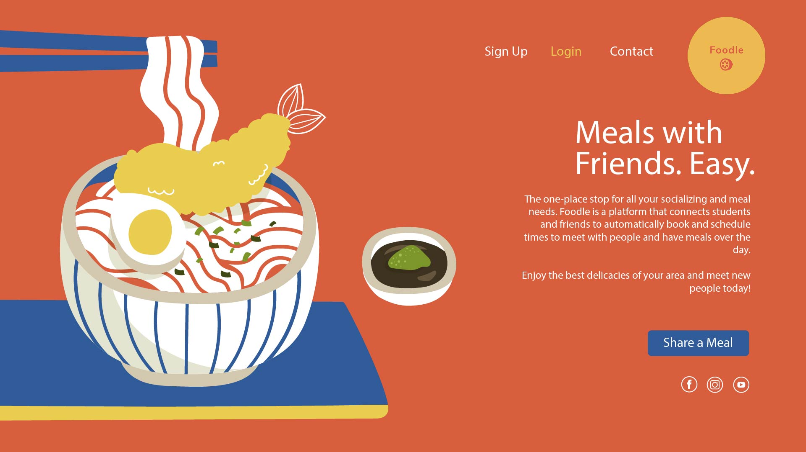
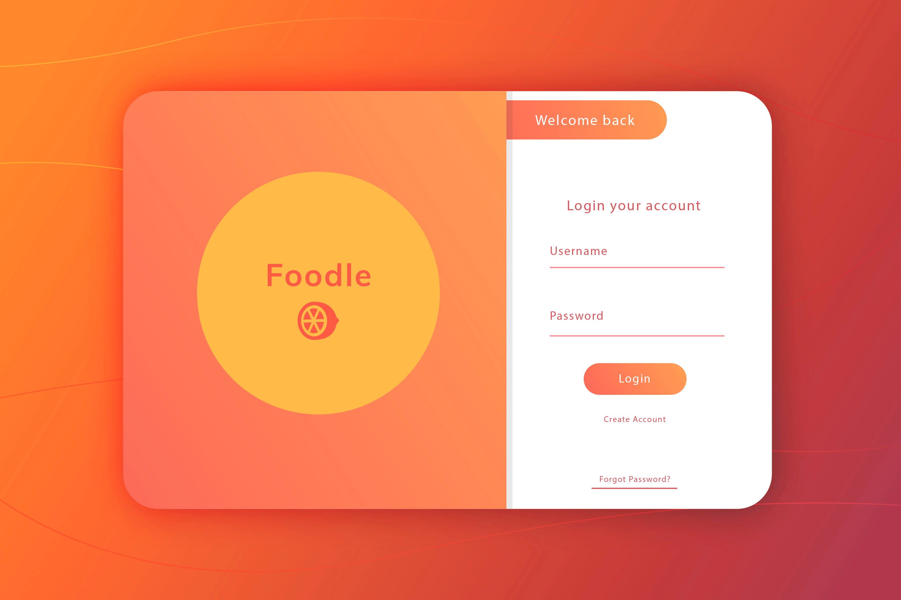
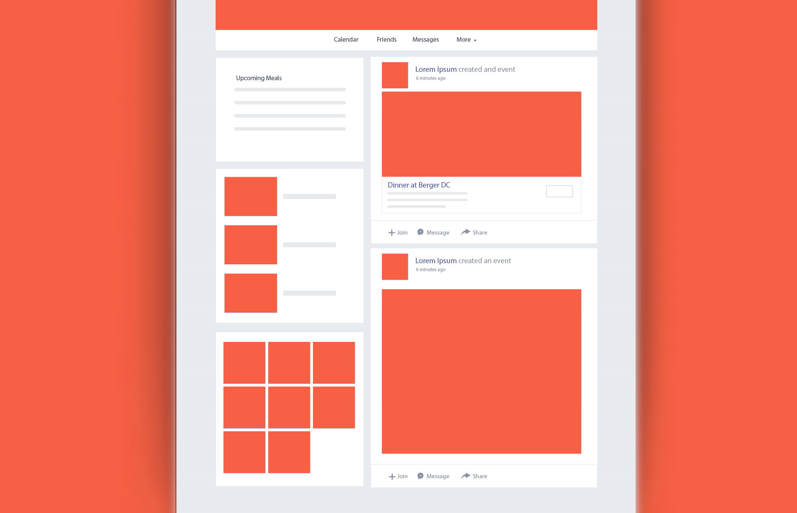
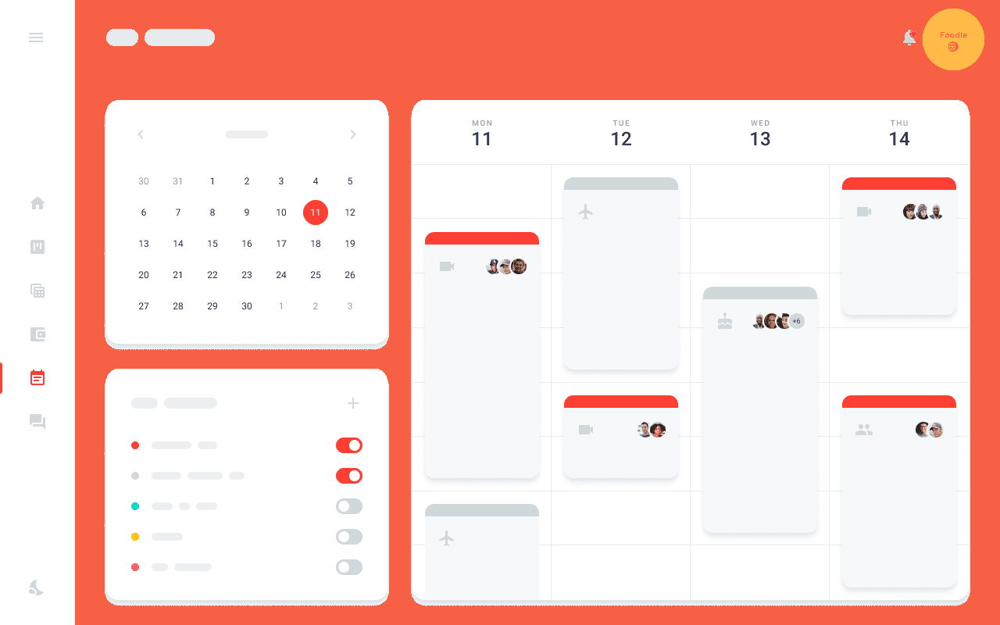
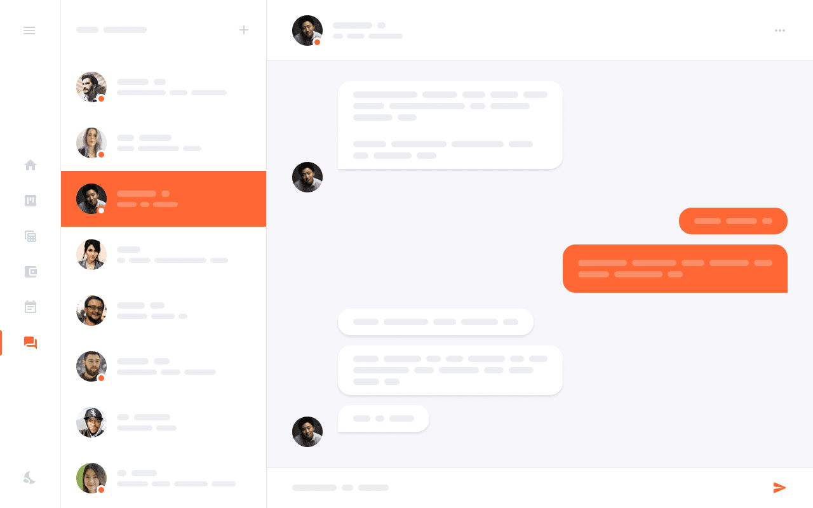
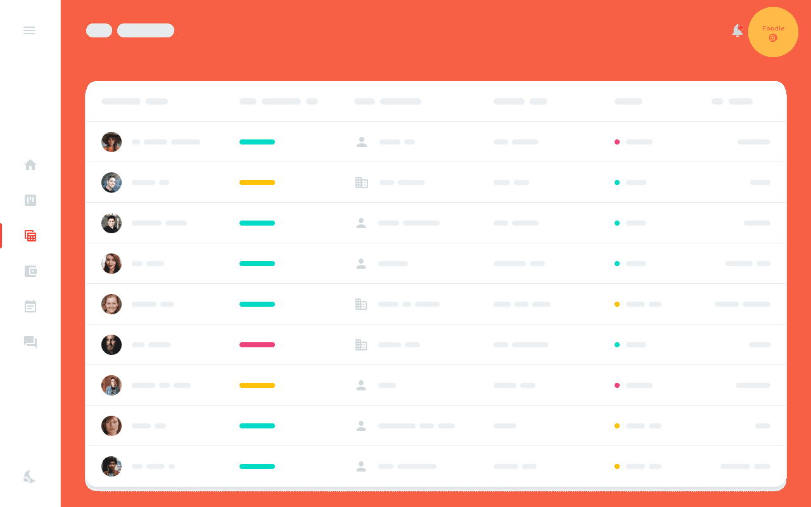

# MILESTONE 1

### Team Omega

### Name: Foodle

## Team Members

- Nathaniel Hansche
- Adrian Chase
- Jawad Alam

## Part 0: Data Interactions

Each day I try to have my meals with different groups of people so that I can keep up with all of my friends. However, coordinating meals with different groups each day is often a hassle. I either have to message a bunch of people separately or make a new group chat to make sure that everybody is free at the same time, and then invite other friends if anyone isn't available. Doing this for multiple meals each day takes up a non-negligible amount of time and effort. Talking to my friends led me to realize that this is a common issue, especially among those with a large number of friends. This issue led me to come up with the idea for a social media application, Foodle.
The core features of Foodle are as follows:
- Users will be able to specify for each day which time windows they're available for each meal. This information will be viewable to their friends, and each user will be shown which of their friends have available time overlapping with their own.
- Users will be able to create a post for "hosting" a meal. Each post will include a planned meeting time, ending time, and dining location (using the Google Maps API). When creating a post, users will be able to click a single button to invite each friend, and the list of friends will be organized by time availablity. After selecting a time slot, only the friends who have overlapping availability will be shown. The user will be able to specify whether the post should be shown to friends only, or whether it should be made public to allow any nearby user to see it.
- The homepage of Foodle will consist of the user's feed, displaying a list of all posts for meals which fall within the user's specified time availability. The user will be able to request to attend any of these meals by clicking an "Ask to Join" button on the post.
- Any users agreeing to attend the same meal will be added to a temporary groupchat which expires 24 hours after the meal's ending time, allowing attendees to coordinate plans, find seats, etc. A meal's attendees include any users who either accepted an invitation from the host or had the host accept their request to join.
By offering these features, Foodle streamlines the process of planning meals with friends. Using Foodle will make it simple to have an active social life with far less effort than before, allowing users to make breakfast, lunch, and dinner plans for an entire day with just a few clicks.

## Part 1: Wireframes

### Landing / Home Page

### Login Page

### Social Feed

### Calendar

### Chat

### Friends List

## Part 3: HTML/CSS UX
